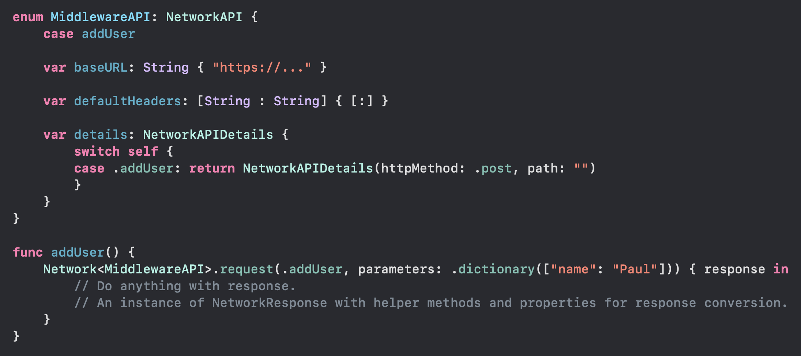

# simple-ios-networking
Networking in iOS doesn't have to be complicated nor need a huge library. A sleek & light weight wrapper does the job.

## Usage

## Installation
Directly drag the src files into a folder in your project.
That's it. This is the least amount of code which can get you started with networking in iOS. From hereby, you can extend the capabilities of this wrapper.
